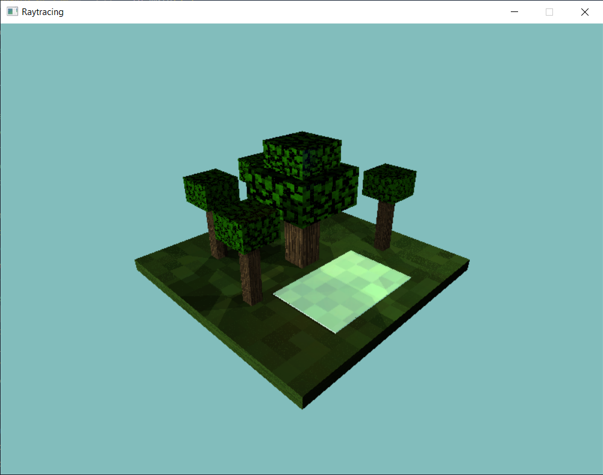

# Raytracing_Rust_Project


## Descripción

Este proyecto demuestra la implementación de un raytracing avanzado en Rust, creando una escena de bosque con múltiples materiales, iluminación dinámica y efectos visuales. El proyecto se enfoca en la creación de una escena visualmente atractiva que incluye árboles, agua, y efectos de iluminación estilo Minecraft.


## Características

- **Raytracing Avanzado:** Implementación de un raytracer con soporte para reflexiones, refracciones y sombras.
- **Materiales Realistas:** Cinco materiales diferentes con texturas y propiedades únicas:
  * Madera con textura y propiedades específicas
  * Hojas con textura y transparencia
  * Tierra/césped con textura detallada
  * Agua con reflexión y transparencia
  * Piedra con textura y propiedades realistas
- **Iluminación Dinámica:** Sistema de múltiples fuentes de luz con diferentes colores e intensidades.
- **Ciclo Día/Noche:** Sistema dinámico de iluminación que simula el paso del tiempo.
- **Materiales Emisivos:** Soporte para objetos que emiten luz propia.
- **Control de Cámara:** Sistema de cámara interactivo con zoom y rotación.
## Requisitos

- Rust 1.60 o superior
- [Cargo](https://doc.rust-lang.org/cargo/) (incluido con Rust)
- Dependencias:
  - nalgebra-glm 0.18.0
  - minifb 0.26.0
  - rayon 1.5
  - image 0.25.2

## Demostración 


## Instalación

1. Clona el repositorio:
   ```bash
   git clone https://github.com/Maria-Villafuerte/Raytracing_Rust_Project.gitRaycasting_3D_Basics_Rust.git
2. Navega al directorio del proyecto
   ```bash
   cd Raytracing_Rust_Project
3. Instala las dependencias:
   ```bash
   cargo build
4. Ejecuta el proyecto:
   ```bash
   cargo run
## Controles
- **Flechas:** Rotar la cámara
- **Q/E:** Acercar/Alejar la vista
- **ESC:** Salir

## Estructura del Proyecto
   ```bash
   src/
├── main.rs          # Punto de entrada y configuración principal
├── camera.rs        # Sistema de cámara
├── materials.rs     # Definición de materiales
├── scene.rs         # Manejo de escena y ciclo día/noche
├── cube.rs          # Geometría de objetos
└── color.rs         # Manejo de colores
   ```


## Criterios de Evaluación

- [20 puntos] Por qué tan compleja sea su escena
- [10 puntos] Por qué tan visualmente atractiva sea su escena
- [25 puntos] Según el performance de su raytracer.
- [25 puntos] por cada material diferente que implementen, para un máximo de 5 (piensen en los diferentes tipos de bloques en minecraft)
	1. wood_material (textura propia, parámetros específicos)
	2. leaf_material (textura propia, parámetros específicos)
	3. soil_material (textura propia, parámetros específicos)
	4. water_material (transparencia, reflexión)
	5. stone_material (textura propia)
- [5 puntos] Modificar la cámara para que se pueda acercar y alejar en la dirección de su center.
- [10 puntos] Agregar soporte para múltiples fuentes de luz con diferentes colores e intensidades.
- [10 puntos] Implementar un ciclo de día y noche con condiciones de iluminación cambiantes.Puede ser que la luz cambie de posición y color según el tiempo o al presionar algunos botones
- [15 puntos] Agregar soporte para materiales emisivos que actúen como fuentes de luz por sí mismos.
